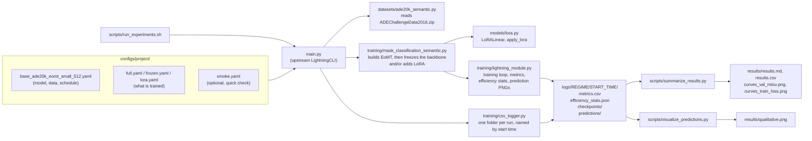
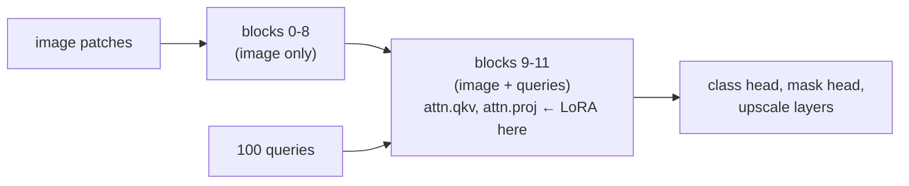

# How the code works

This document explains what we added to the official EoMT code and how the pieces fit together.
Everything not mentioned here is the unchanged upstream code.

## The big picture



In words:

1. **Configs** describe a run. The base config is shared by all regimes, and the regime config
   only says what is trained. They are stacked with `-c base.yaml -c lora.yaml`; later files
   override earlier ones.
2. **`main.py`** (unchanged upstream code) reads the configs, builds the dataset, the model, the
   logger and the PyTorch Lightning trainer, and starts training.
3. **The model** is built in `mask_classification_semantic.py`. It creates EoMT as upstream
   does, then freezes the backbone and/or adds LoRA layers, depending on the regime.
4. **During training**, `lightning_module.py` runs the upstream training loop and writes our
   extra outputs: parameter counts, time and memory, and prediction images.
5. **After training**, two scripts turn the run folders into the results table, the curves and
   the qualitative figure.

## What each regime trains

EoMT-S uses a ViT-S backbone with 12 transformer blocks. The 100 segmentation queries are added
before the last 3 blocks (`num_blocks: 3`, called L2 in the paper). In those blocks the queries
and the image patches attend to each other, and the heads turn the query tokens into masks and
classes.



| Regime | Backbone blocks 0-8 | Backbone blocks 9-11 | Queries + heads |
|---|---|---|---|
| `full` | trained | trained | trained |
| `frozen` | frozen | frozen | trained |
| `lora` | frozen | frozen, plus trainable LoRA on `qkv` and `proj` | trained |

"Frozen" means the weights get no gradient and never change. Gradients still flow *through*
frozen blocks, so the queries in blocks 9-11 can still learn.

Parameter counts at 512×512 (from `efficiency_stats.json`):

| Regime | Trainable parameters | Share of the backbone that is trained |
|---|---|---|
| `full` | 23.7 M | 100% |
| `frozen` | 1.73 M (queries and heads) | 0% |
| `lora` | 1.78 M (queries, heads and 55,296 LoRA parameters) | 0.25% |

## The files we added or changed

### `models/lora.py`: the LoRA layer

A normal linear layer computes `y = W x`. LoRA keeps `W` frozen and adds a small trainable
correction made of two thin matrices:

```
y = W x  +  (alpha / rank) · B (A x)
```

- `A` has shape `rank × in` and `B` has shape `out × rank`. With rank 8 and ViT-S sizes, that is
  a few thousand numbers instead of the hundreds of thousands in `W`.
- `B` starts at zero, so at the start of training the correction is zero and the model behaves
  exactly like the pretrained one. `A` starts random (Kaiming init). Otherwise both matrices
  would get zero gradients and never learn.
- `alpha / rank` is a fixed scale factor. We use `alpha = rank = 8`, so the scale is 1.

`apply_lora(backbone, block_indices, rank, alpha, modules)` goes to each chosen block, takes
`block.attn.qkv` and `block.attn.proj`, and replaces each with a `LoRALinear` that wraps the
original layer. It returns how many parameters were added. If a requested layer does not exist
or is not a linear layer, it raises an error instead of quietly skipping it.

EoMT's own attention code calls `module.qkv(x)` and `module.proj(...)`, so the wrapped layers
are used automatically. No other model code needed to change.

### `training/mask_classification_semantic.py`: freezing and LoRA options

Four new settings, which can be set in the config files:

| Setting | Default | Meaning |
|---|---|---|
| `freeze_backbone` | `false` | stop all ViT backbone weights from training |
| `lora_rank` | `0` | LoRA rank; 0 means no LoRA |
| `lora_alpha` | = rank | LoRA scale numerator |
| `lora_modules` | `[qkv, proj]` | which attention layers get LoRA |

After the upstream model is built (including loading the pretrained DINOv2 weights), the code:

1. freezes the backbone if `freeze_backbone` is set;
2. if `lora_rank > 0`, adds LoRA to the last `num_blocks` blocks, so LoRA always follows the
   blocks that process the queries.

The order matters: freezing first and adding LoRA second means the original weights are frozen
while the new LoRA weights stay trainable.

### `training/lightning_module.py`: measurements and outputs

- **At the start of training** (`on_fit_start`):
  - Counts total, trainable and backbone parameters.
  - Measures GFLOPs for one image with `fvcore`.
  - Starts a timer and resets the GPU peak-memory counter.
  - Works out the mask-annealing steps (see below).
- **At the end of training** (`on_train_end`): adds the training time, seconds per step and peak
  GPU memory, and writes everything to `efficiency_stats.json` in the run folder. This file is
  only written when training finishes, which is how the result scripts tell finished runs apart
  from crashed ones.
- **Mask annealing.** EoMT trains with masked attention and slowly switches it off, one query
  block after another, so the final model does not need it. Upstream hard-codes the steps where
  this happens for its own schedule length. When the config does not give them, we compute them
  from our total number of steps, using the same fractions of training as upstream. For our
  3 blocks, annealing starts at 1/6, 5/12 and 2/3 of training and each takes 1/6 of training.
- **A second mIoU** (`metrics/val_iou_present`). The standard mIoU (`metrics/val_iou_all`)
  averages the IoU of all 150 classes, and a class that appears in neither the ground truth
  nor the predictions counts as 0. On the full validation set every class appears, so this is
  the paper's metric and the one we report. On the few images of a smoke test, most classes
  never appear, so the standard mIoU is close to 0 even when the model is doing well on what it
  sees. The second mIoU averages only over the classes that do appear. It is a debugging aid.
- **Prediction images.** Upstream uploads a picture of the first validation image (input,
  ground truth, prediction) to wandb. We don't use wandb, so these pictures are saved as PNG
  files in the run's `predictions/` folder, one per epoch and query block.

### `training/csv_logger.py`: one folder per run

The standard Lightning CSV logger names run folders `version_0`, `version_1`, and so on. Ours
names them after the start time, e.g. `logs/lora/2026-09-26_14-03-12/`, so repeated attempts
never overwrite each other and are easy to tell apart.

### `configs/project/`

- `base_ade20k_eomt_small_512.yaml`: the shared setup. It covers the model (EoMT-S with
  DINOv2 ViT-S/14, 100 queries, 3 query blocks), the data (ADE20K at 512×512, batch 16), the
  paper's optimizer settings (lr 1e-4, layer-wise decay 0.8, weight decay 0.05), the number of
  epochs, and CSV logging to `logs/`.
- `full.yaml`, `frozen.yaml`, `lora.yaml`: only the regime settings and the run name.
- `smoke.yaml`: 1 epoch of 20 training batches and 5 validation batches, logging every step.

### `scripts/`

- `run_experiments.sh [full] [frozen] [lora] [--smoke] [extra args]`: trains the given regimes
  one after another on the current machine (give each machine one regime to run them in
  parallel) and saves each console output to
  `logs/<regime>_<start time>.out`. It stops if a run fails.
- `summarize_results.py`:
  - For each regime, picks the latest finished run (or the one given with `--run`) and reads
    `metrics.csv` and `efficiency_stats.json`.
  - Writes the results table (`results.md`, `results.csv`), with the final mIoU and the
    difference from full fine-tuning.
  - Writes the validation mIoU and training loss curves.
- `visualize_predictions.py`: rebuilds each regime's model from the configs, loads its
  checkpoint, predicts a few fixed validation images with the same sliding-window method as
  validation, and draws image | ground truth | full | frozen | LoRA side by side.

### `tests/test_lora.py`

Five quick CPU tests on a tiny fake ViT. They check that:

1. a LoRA layer gives exactly the same output as the original layer at the start;
2. LoRA is added to the right blocks with the right number of parameters;
3. after freezing and adding LoRA, training changes only the LoRA weights;
4. a wrong block index raises an error;
5. a wrong layer name raises an error.

Run them with `python -m pytest tests`.

## Things to keep in mind when reading results

- For the first 500 steps, full and frozen training behave the same, and the LoRA weights do
  not change yet (in a smoke test of 20 steps they stay exactly at their starting values). The paper's warmup trains
  only the new parameters (queries and heads) first, then warms up the backbone learning rate
  over the next 1,000 steps. The regimes only start to differ after that.
- LoRA parameters live inside the backbone blocks, so they get the backbone's learning rate and
  warmup, the same as the weights they adapt.
- All regimes use the same hyperparameters. We did not tune the learning rate per regime, which
  might favour one regime over another.
